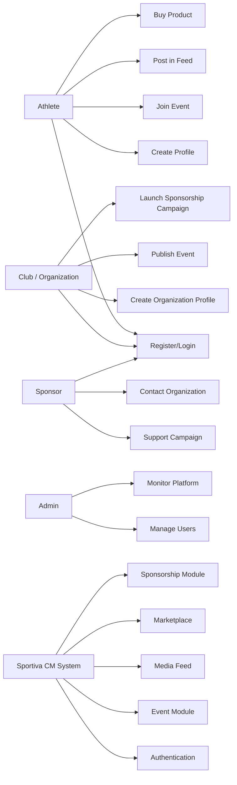
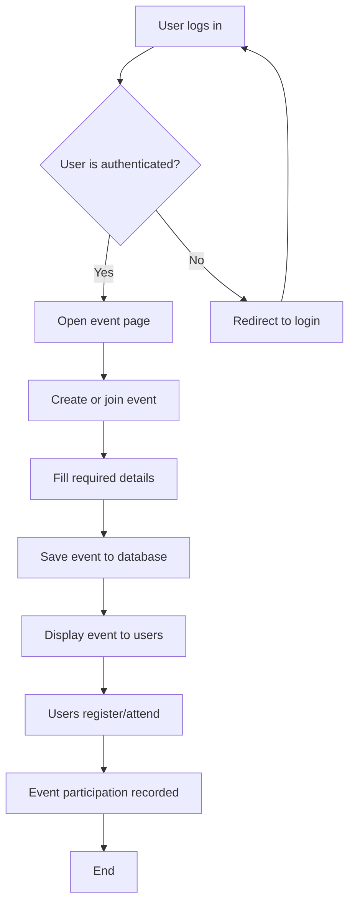
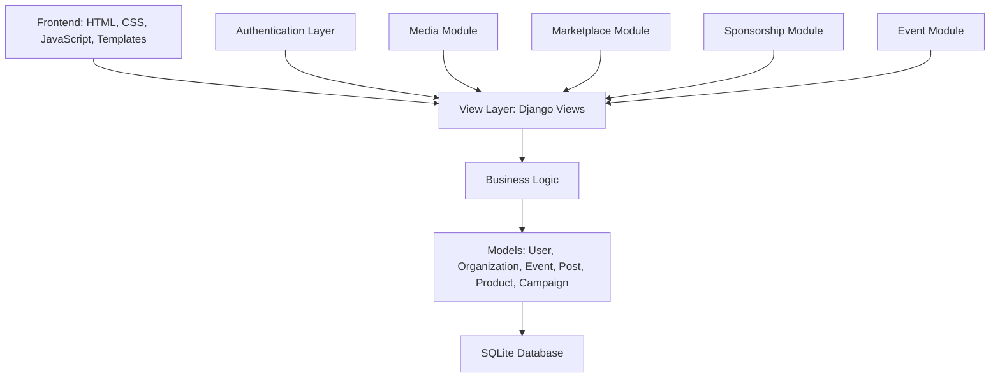
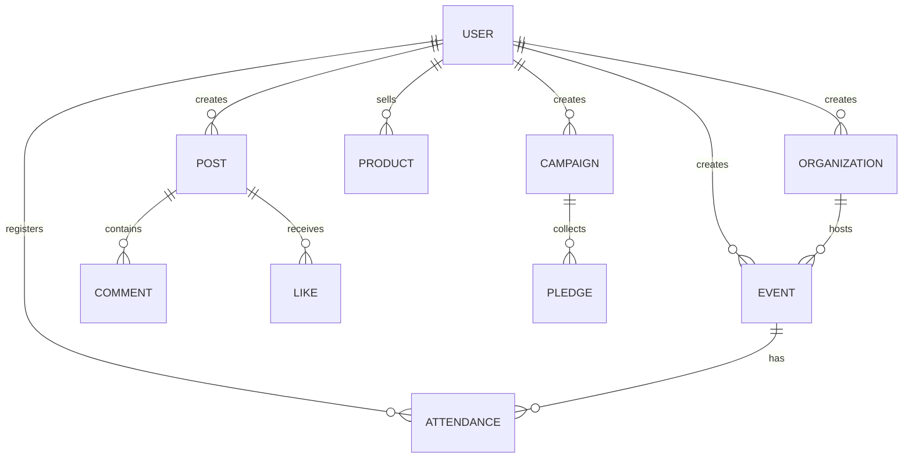
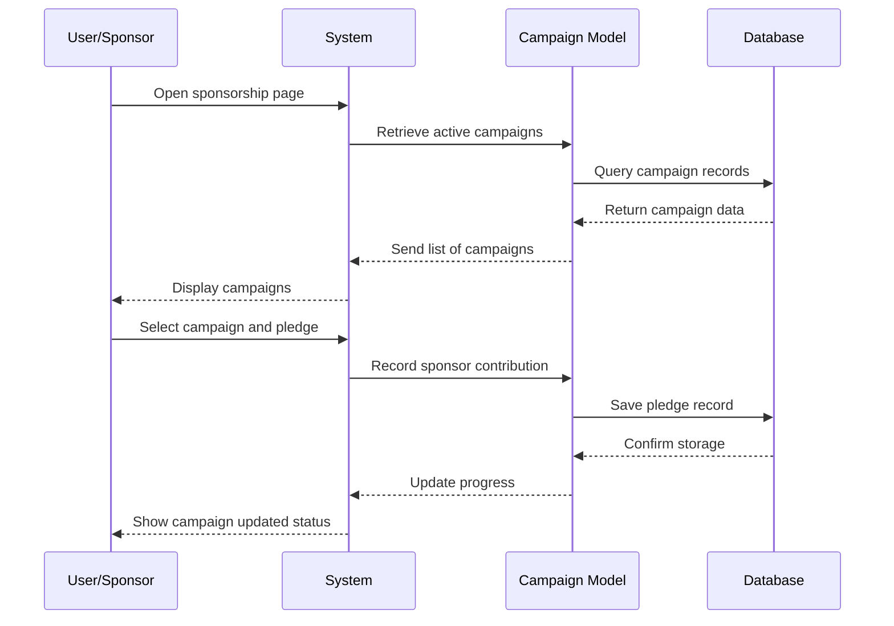

# Sportiva CM — Analysis, Diagrams and Defense Notes

## 1. Project Overview

Sportiva CM is a Django-based sports platform built for Cameroon. It connects athletes, sports clubs, coaches, sponsors, and fans in a single digital ecosystem. The system supports several core activities, including organization registration, event creation, media sharing, membership interaction, sports marketplace sales, and sponsorship campaigns.

The platform is relevant because Cameroon has a strong sports culture, but many clubs, athletes, and organizations still lack a digital space for effective promotion, coordination, and community engagement. Sportiva CM solves this by creating a unified platform for sports visibility, participation, and support.

---

## 2. Business and Problem Analysis

### 2.1 Problem Identification

The core problems addressed by Sportiva CM are:

- Low visibility of local sports clubs and athletes;
- Weak communication between teams, fans, and sponsors;
- Poor event promotion and attendance tracking;
- Lack of a centralized place for sports media and updates;
- Limited access to sports products and equipment market;
- Difficulty organizing local sponsorship and fundraising campaigns.

### 2.2 Business Need

Cameroon has many active sports communities, but they often operate in disconnected ways. Sports events are announced informally, clubs do not always have digital profiles, and sponsors struggle to identify promising opportunities. Sportiva CM resolves this by creating a single online platform where sports stakeholders can interact and collaborate.

### 2.3 Why the Solution Matters

The platform helps to:

- increase visibility of sports actors;
- improve event participation;
- create stronger community engagement;
- promote economic activity through marketplace services;
- support sponsorship and sports fundraising.

---

## 3. Stakeholders and Users

### 3.1 Main Users

- Athletes
- Clubs / Academies / Organizations
- Coaches / Trainers
- Sponsors / Businesses
- Sports Fans / General Users
- Administrators

### 3.2 User Requirements

- Register and create personal profiles;
- Manage organization information;
- Publish or join sports events;
- Share updates on a media feed;
- Explore marketplace listings;
- Create or support sponsorship campaigns;
- Communicate through WhatsApp/contact features.

---

## 4. Functional Analysis

### 4.1 User Registration and Authentication

Users can create accounts, log in, and manage their roles. The custom user model in the project supports multiple roles, such as athlete, organization, trainer, and sponsor. This enables personalized interaction and role-specific features.

### 4.2 Organization Management

Organizations can create sports profiles with details such as name, category, location, and contact information. This feature allows clubs and sports entities to establish a professional online identity.

### 4.3 Event Management

The platform supports event creation, description, date, and participation. Users can register or join events, increasing interaction and event visibility.

### 4.4 Media Feed

Users can publish updates, images, or posts about sports activities. The feed encourages engagement through comments and likes.

### 4.5 Marketplace

The marketplace promotes the buying and selling of sports-related equipment and products. It supports local commerce and helps sport actors access needed products more easily.

### 4.6 Sponsorship System

Sponsors can create campaigns or contribute to them. This adds a fundraising dimension to the project and helps support clubs, tournaments, and training programs.

---

## 5. System Requirements Analysis

### 5.1 Functional Requirements

- User authentication;
- Role-based user management;
- Organization registration;
- Event creation and attendance;
- Feed posting and content interaction;
- Product listing and marketplace search;
- Sponsorship creation and donation support;
- Secure and accessible communication through contact links.

### 5.2 Non-functional Requirements

- Responsive and easy-to-use interface;
- Secure handling of user data;
- Fast access to information for sports stakeholders;
- Modular design for future expansion;
- Friendly local user experience for Cameroon-based contexts.

---

## 6. Use Case Diagram

This diagram shows the interaction between the system and the main actors.

### 6.1 Step-by-Step Explanation

1. The athlete logs in to the system.
2. The athlete creates a personal profile and joins events.
3. The athlete posts updates or interacts with the feed.
4. The athlete can buy gear from the marketplace.
5. The club creates an organization profile and publishes events.
6. The sponsor reviews available campaigns and supports a club or event.
7. The admin manages users and monitors platform performance.

### 6.2 Example

Example: A football club creates an organization profile, publishes a local tournament, and a sponsor contributes funding through the sponsorship module. At the same time, fans can register for the event and follow updates in the media feed.

---

## 7. Activity Diagram

This diagram explains the process of creating and participating in a sports event.

### 7.1 Step-by-Step Explanation

1. The user must first log in.
2. If authentication fails, they are redirected to the login page.
3. After successful login, the user opens the event module.
4. The user creates an event or joins an existing one.
5. The system validates and stores the data.
6. The event becomes visible to others.
7. Participants register and their attendance is saved.

### 7.2 Example

Example: A coach creates a basketball tournament, adds the date and location, and the system displays it online. Fans register and attend the event, and attendance is tracked for future engagement.

---

## 8. Architecture Diagram

This diagram shows the layered design of the application.

### 8.1 Step-by-Step Explanation

1. The user interacts with the frontend.
2. The request is handled by the Django views.
3. The logic processes the request and communicates with the models.
4. The database stores and retrieves data.
5. Results are sent back to the user interface.

### 8.2 Example

Example: A user visits the marketplace page, the view requests product data, the model retrieves product records from the database, and the page displays the available items to the user.

---

## 9. Entity Relationship Diagram (ERD)

This diagram explains the core data relationships in the project.

### 9.1 Step-by-Step Explanation

1. A user can create many organizations, posts, events, products, and campaigns.
2. A club or organization can host multiple events.
3. An event can have multiple registrations or attendances.
4. A post can receive many comments and likes.
5. A campaign can receive many pledges from users.

### 9.2 Example

Example: One sports club (organization) creates multiple events. Users then register for those events, and each registration is stored as attendance data linked to the event and user.

---

## 10. Sequence Diagram

This diagram illustrates how a sponsor supports a campaign.

### 10.1 Step-by-Step Explanation

1. The sponsor opens the sponsorship page.
2. The system retrieves all active campaigns.
3. The database returns the campaign list.
4. The sponsor selects a campaign and pledges support.
5. The campaign progress is updated and stored.
6. Users can see the latest funding level.

### 10.2 Example

Example: A football academy launches a sponsorship campaign for kits and training equipment. A sponsor donates funds, and the campaign dashboard updates to show the new funding progress.

---

## 11. Data Flow Analysis

### 11.1 Event Flow

User -> Login -> Event Creation -> Data Validation -> Save to Database -> Event Display -> Registration -> Attendance Record

### 11.2 Marketplace Flow

User -> Search Product -> View Details -> Add to Interaction -> Purchase/Contact -> Data Record

### 11.3 Sponsor Flow

Sponsor -> Open Campaign -> Review Target -> Commit Support -> Update Campaign -> Display Progress

---

## 12. Diagram Summary for Defense Presentation

### Diagram 1: Use Case Diagram
Purpose: shows overall system users and actions.

### Diagram 2: Activity Diagram
Purpose: explains event creation and participation flow.

### Diagram 3: Architecture Diagram
Purpose: shows technical layers and how data moves.

### Diagram 4: ER Diagram
Purpose: explains database relationships.

### Diagram 5: Sequence Diagram
Purpose: explains sponsor contribution process.

---

## 13. PowerPoint Slide Recommendations

### Slide 1 — Title
Sportiva CM
Sports Promotion and Community Platform for Cameroon

### Slide 2 — Problem Statement
Low sports visibility, weak communication, poor event promotion, limited sponsorship support.

### Slide 3 — Objectives
Connect actors, promote events, build community, support commerce and sponsorship.

### Slide 4 — System Features
User profile, organization, events, feed, marketplace, sponsorships.

### Slide 5 — Use Case Diagram
Show actor interaction with the system.

### Slide 6 — Activity Diagram
Display the event flow.

### Slide 7 — Architecture Diagram
Show client, app layers, database.

### Slide 8 — ER Diagram
Display relationships among user, event, post, campaign, and product.

### Slide 9 — Sequence Diagram
Show sponsor campaign contribution flow.

### Slide 10 — Challenges and Solutions
Explain modularity, role-based design, communication features, visibility support.

### Slide 11 — Future Work
Multilingual support, payment features, mobile app, analytics, cloud deployment.

### Slide 12 — Conclusion
Sportiva CM is a useful, scalable digital solution for sports development in Cameroon.

---

## 14. Example Defense Explanation for a Jury Member

“Sportiva CM was developed to solve the lack of digital visibility and organization in the sports ecosystem. The project allows clubs to create profiles, fans to engage with events, sponsors to contribute to campaigns, and users to access marketplace products. The use case diagram shows how each actor interacts with the system, while the ER diagram explains how data relationships support the platform. The architecture diagram presents the technical structure, and the sequence diagram demonstrates how a sponsor contribution updates the sponsorship progress. This makes the platform both practical and scalable.”

---

## 15. Final Conclusion

Sportiva CM is a relevant project because it addresses a genuine social and economic need. It brings together sports promotion, community engagement, digital interaction, and local business opportunities into a single system. The diagrams and analysis show that the platform is not only functional but also well-structured and adaptable for future growth.

This project is strong for defense because it demonstrates real problem-solving, technical design, and a clear understanding of user requirements.
