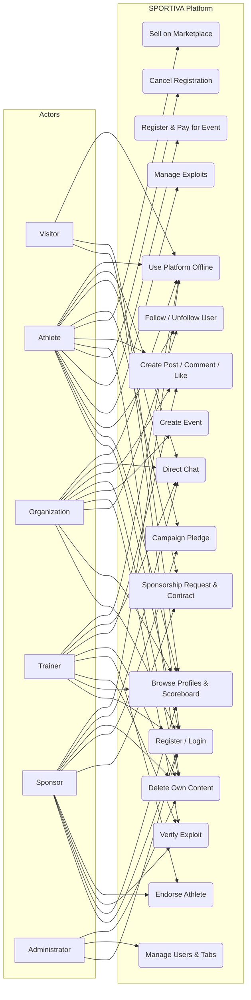
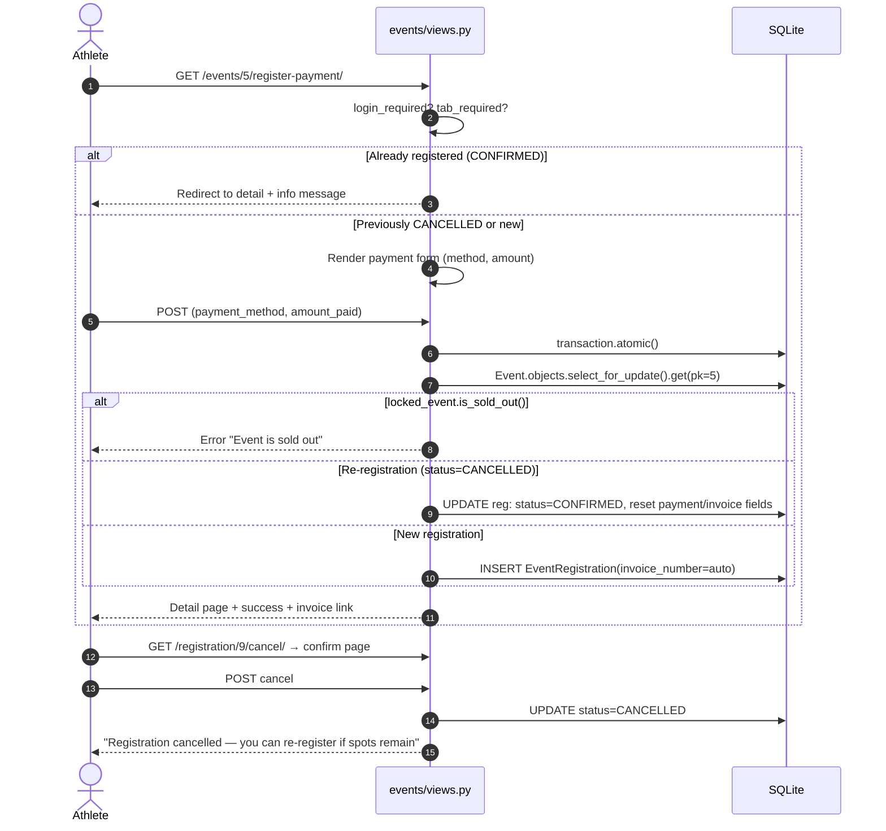
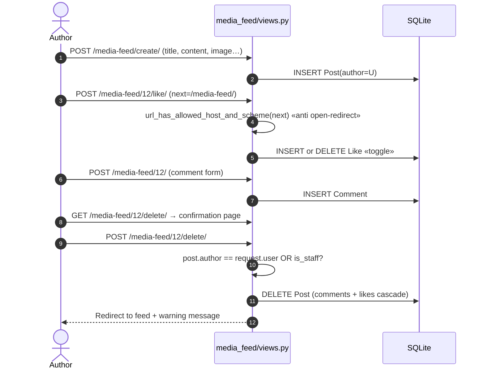
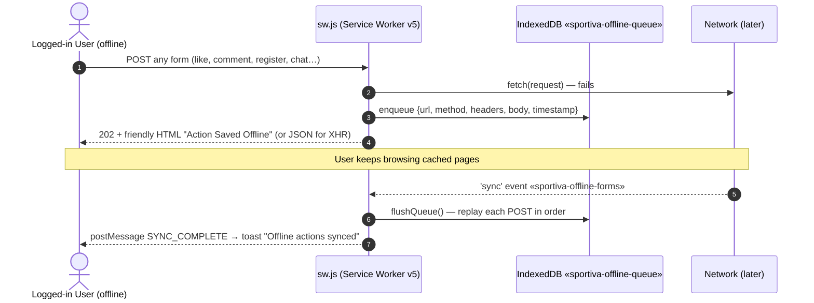
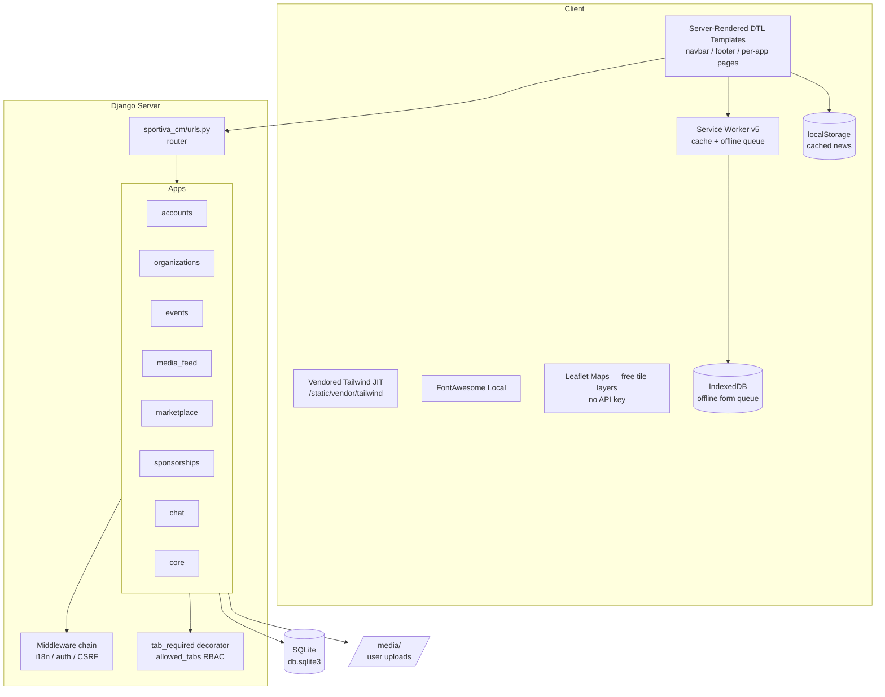

# SPORTIVA CM 2.0 — Complete Project Analysis with UML

**Global Sports Network & Talent Monetization Platform**
Academic Capstone Project — Jury Defense Edition
Date: 2026-09-24 | Stack: Django 6.0.7 (Python), SQLite, Server-Rendered Templates (Django Template Language), Tailwind CSS (vendored), Vanilla JavaScript PWA

---

## 1. Project Overview

SPORTIVA CM 2.0 is an **offline-first Progressive Web Application** that connects five sports actor types on a single platform: athletes, clubs/organizations, coaches, sponsors, and fans. Its differentiator is a **merit-verified scoring engine (Sportiva Score)** that converts real athletic achievements into a reputation currency used for sponsorship matchmaking, event access, and profile visibility.

### 1.1 Core Functional Modules

| Module | Purpose |
|---|---|
| `accounts` | Registration, authentication, 5 global roles, profiles, follows, athlete exploits (merits), endorsements, admin user management |
| `organizations` | Club / academy profiles linked to sports categories |
| `events` | Tournament creation, paid/free registration with invoices, capacity control, cancellation, re-registration, PDF invoices |
| `media_feed` | Instagram-style social feed: posts (images/video/shorts), comments, likes |
| `marketplace` | Classified listings for sports gear with seller contact (chat / WhatsApp) and geo-location |
| `sponsorships` | Sponsorship requests, contracts, crowdfunding campaigns, pledges |
| `chat` | Real-time direct messaging between any two users |
| `core` | Home page, offline page, service worker + manifest routes, live sports news API |

### 1.2 Non-Functional Pillars

1. **Offline-first (PWA)** — every page and every write action must work without a network: cache-first static assets, network-first HTML with cache fallback, and an IndexedDB write-queue replayed via Background Sync.
2. **Zero external dependencies** — no CDN, no API keys, no build pipeline. All libraries (Tailwind, FontAwesome, Leaflet) are vendored locally.
3. **Universality** — 6 languages (EN, FR, ES, DE, AR, PT) via Django i18n.
4. **Security** — CSRF everywhere, same-host redirect validation, owner-or-staff authorization on every destructive action, atomic capacity checks.

---

## 2. Actors

| Actor | Description |
|---|---|
| **Visitor** | Unauthenticated user; read-only browsing of public pages |
| **Athlete** | Competitor; owns exploits, registers for events, sells gear, posts content |
| **Organization** | Club/academy; creates events, verifies athlete exploits |
| **Trainer** | Coach; verifies exploits, endorses athletes, trains |
| **Sponsor** | Business; proposes sponsorship, funds campaigns |
| **Administrator** | Staff user; full moderation: delete any content, manage user tabs |

The 5 roles share one `User` model (`AUTH_USER_MODEL = 'accounts.User'`) with role-based **tab visibility**: each request carries `allowed_tabs`, and every navbar tab is rendered only if present in that list (`tab_required` decorator guards the matching views).

---

## 3. Use-Case Diagram



**Universal use case — "Cancel any decision":** every actor can reverse their own actions: cancel event registration (and re-register), delete own posts/comments/products/exploits/campaigns, withdraw sponsorship proposals, delete pledges, retract endorsements, unlike (toggle), unfollow (toggle). Destructive flows follow one uniform pattern: **GET → confirmation page → POST → delete → redirect + message**.

---

## 4. Class Diagram (Domain Model)

```mermaid
classDiagram
    class User {
        +str username
        +str role  «ATHLETE|ORGANIZATION|TRAINER|SPONSOR|VISITOR»
        +str country
        +str city
        +str phone_number
        +ImageField avatar
        +int sportiva_score  «computed»
        +str sportiva_tier  «Legendary…Rookie»
        +sportiva_score_annotation()  «SQL annotate»
    }
    class Follow {
        +User follower
        +User followed_user
    }
    class AthleteExploit {
        +User athlete
        +str title
        +str competition_name
        +str category  «MEDAL|TITLE|RECORD|MVP|OTHER»
        +str status  «PENDING|VERIFIED|REJECTED»
        +int score_points
        +User validated_by
        +ImageField proof_image
        +url proof_link
    }
    class AthleteEndorsement {
        +User athlete
        +User endorsed_by
        +str skill_or_merit
        +str comment
    }
    class OrganizationProfile {
        +User user  «1:1»
        +str organization_name
        +SportsCategory sports_category
    }
    class SportsCategory {
        +str name
    }
    class Event {
        +User organizer
        +OrganizationProfile organization
        +str title
        +str city / country
        +float latitude / longitude
        +int capacity
        +int entry_fee / str currency
        +datetime start_date
        +str SPORT_IMAGE_MAP  «class const»
        +trophy_image_key()  «property»
        +is_sold_out()
        +spots_remaining()  «property»
    }
    class EventRegistration {
        +Event event
        +User user
        +str status  «CONFIRMED|CANCELLED»
        +str invoice_number
        +int amount_paid
        +str payment_method
    }
    class Post {
        +User author
        +str title / text content
        +ImageField image
        +url video_url
        +bool is_short
        +str hashtags
        +str city / country
        +int like_count  «property»
        +int comment_count  «property»
    }
    class Comment {
        +Post post
        +User author
        +str content
    }
    class Like {
        +Post post
        +User user
    }
    class Product {
        +User seller
        +ProductCategory category
        +str title
        +int price / str currency
        +str condition
        +str whatsapp_number
        +bool is_available
    }
    class SponsorProfile {
        +User user  «1:1»
        +str company_name
        +str industry
    }
    class SponsorshipRequest {
        +User sender
        +SponsorProfile recipient_sponsor
        +User recipient_athlete
        +Event event
        +str status
        +decimal proposed_amount
    }
    class SponsorshipContract {
        +SponsorProfile sponsor
        +User athlete
        +Event event
        +str terms
        +str status
    }
    class Campaign {
        +User creator
        +str title
        +decimal goal_amount
        +datetime deadline
    }
    class Pledge {
        +Campaign campaign
        +User sponsor
        +decimal amount
    }
    class Conversation {
        +M2M participants «User»
    }
    class ChatMessage {
        +Conversation conversation
        +User sender
        +str content
        +bool is_read
    }

    User "1" -- "*" Follow : follows / is followed
    User "1" -- "*" AthleteExploit : owns
    User "1" -- "*" AthleteEndorsement : receives / gives
    User "1" -- "1" OrganizationProfile : profile
    User "1" -- "*" Event : organizes
    Event "1" -- "*" EventRegistration : has
    User "1" -- "*" EventRegistration : makes
    User "1" -- "*" Post : authors
    Post "1" -- "*" Comment : has
    Post "1" -- "*" Like : has
    User "1" -- "*" Like : gives
    User "1" -- "*" Product : sells
    User "1" -- "1" SponsorProfile : profile
    SponsorProfile "1" -- "*" SponsorshipContract : signs
    User "1" -- "*" SponsorshipContract : athlete side
    Campaign "1" -- "*" Pledge : collects
    Conversation "1" -- "*" ChatMessage : contains
    User "*" -- "*" Conversation : participates
```



### 4.1 Sportiva Score Formula (annotated in SQL to avoid N+1)

```
score = 50                                        (base)
      + Σ verified exploit score_points           (up to 100 each)
      + 5 × followers
      + 2 × endorsements
      + 10 × event participations
      + 3 × posts authored
```

`sportiva_score_annotation()` mirrors the Python property as correlated subqueries so list pages annotate once instead of querying per row.

---

## 5. Sequence Diagrams

### 5.1 Event Registration → Payment → Cancellation → Re-Registration



Key design points: capacity is re-checked **inside the atomic block on the locked row** (race-safe on PostgreSQL; a correct no-op pattern on SQLite), and cancellation sets `status=CANCELLED` instead of deleting the row so the history and invoice survive.

### 5.2 Post → Like → Comment → Delete Own Post



Authorization invariant used by every destructive view in the project:

```python
if obj.owner != request.user and not request.user.is_staff:
    messages.error(request, "You are not authorized…")
    return redirect(safe_fallback)
```

### 5.3 Offline Write Queue (works for every role, incl. admin)



All authenticated write flows inherit this capability for free because interception happens at the service-worker layer, below Django's auth: pages render from cache while offline, and any POST is queued and replayed with its original CSRF token and cookies.

---

## 6. Component & Deployment Diagram



Single-process deployment: `python manage.py runserver` (dev) or any WSGI/ASGI server; static and media served by the web server in production. No external service calls exist anywhere in the architecture — the platform is fully functional on a LAN with no internet access.

---

## 7. Key Design Patterns & Security Measures

| Concern | Solution |
|---|---|
| Authorization | Owner-or-staff checks on every destructive view; `login_required` + `tab_required` on entry |
| Open redirects | `url_has_allowed_host_and_scheme(next/referer, allowed_hosts={request.get_host()})` in login, follow, like |
| Race conditions | `transaction.atomic()` + `select_for_update()` around capacity-sensitive registration |
| CSRF | Django middleware + `` in every form; queued offline POSTs keep their original tokens |
| XSS | DTL auto-escaping; `escHtml()` in JS-rendered news; `escapejs` in JS string contexts |
| SQL injection | ORM exclusively |
| PWA versioning | `CACHE_VERSION` bump (v5) on every asset change; old caches purged in `activate` |
| Consistent UX | One delete/cancel pattern: confirmation page → POST → message banner → redirect |

---

## 8. Test & Quality Baseline

- `manage.py check` — 0 issues
- 27 automated tests passing (accounts, events, feed flows)
- Sport-matched event imagery: `SPORT_IMAGE_MAP` keyword dictionary + 10 local SVG trophies, fallbacks on list/detail/home
- Tabs bar: flex strip with min-width floor (desktop), scrollable strip with all role tabs (mobile)
